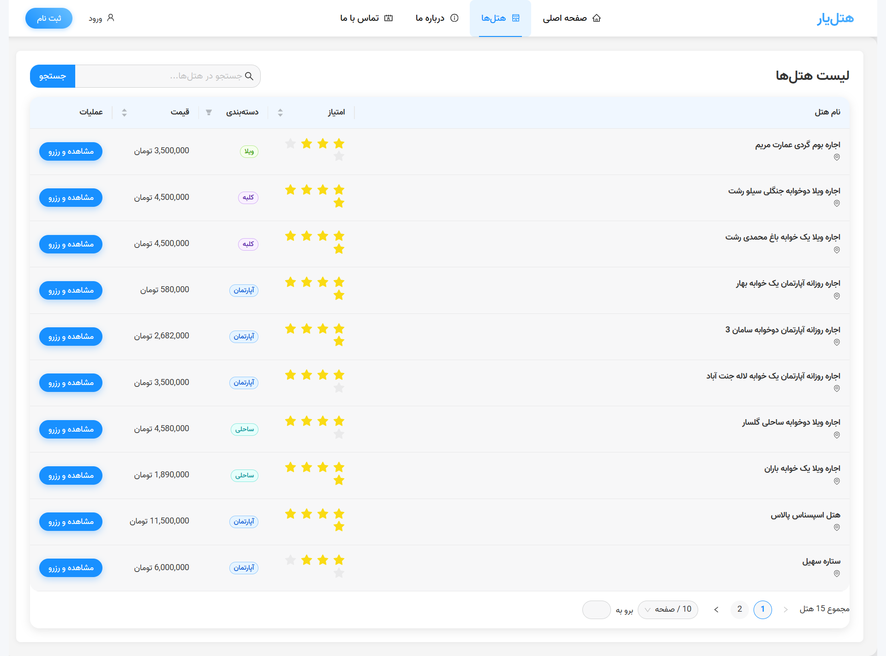
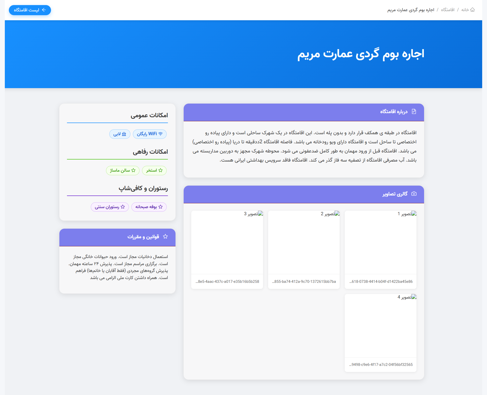
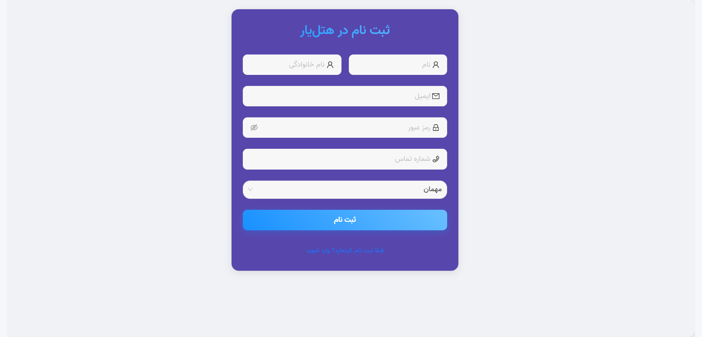
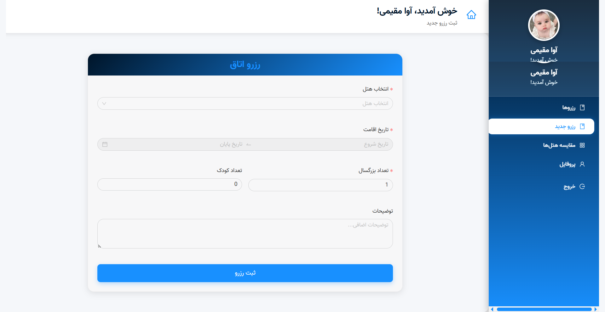
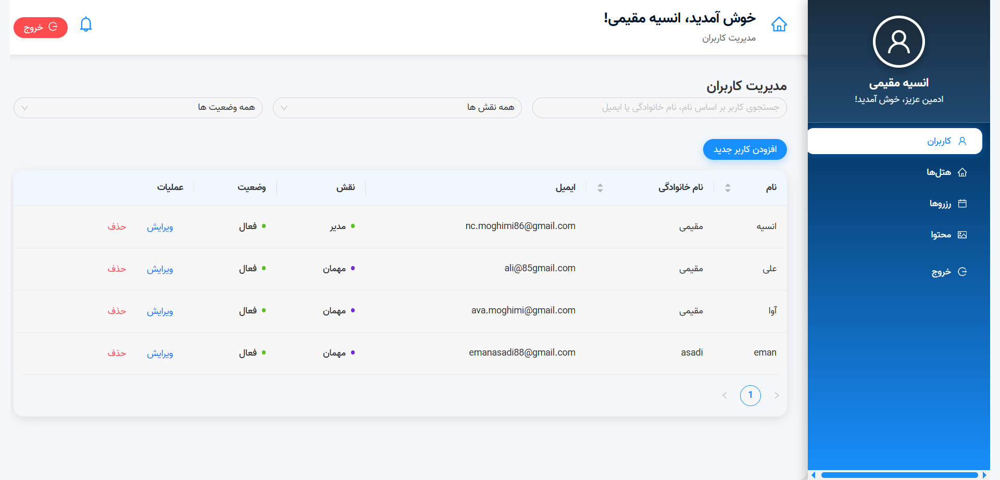
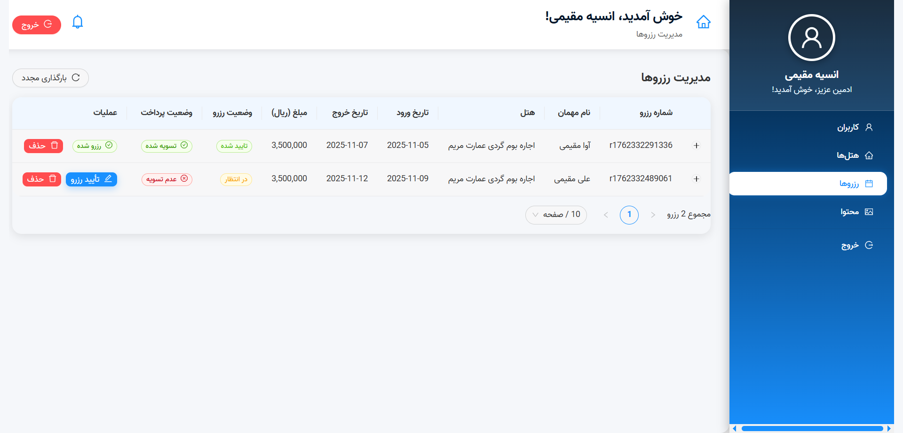

# Hotel Booking System


A complete hotel reservation platform with separate **User** and **Admin** dashboards.

## Features
- ثبت‌نام و ورود با نقش کاربر/ادمین
- جستجو و فیلتر پیشرفته هتل‌ها
- رزرو هتل با تشخیص تداخل تاریخ
- داشبورد کاربر و ادمین کامل
- سیستم نوتیفیکیشن
- طراحی ریسپانسیو با Ant Design

## Tech Stack
- React.js + Vite + React Router + Axios
- Ant Design (v5)
- json-server (mock API)
- db.json as database

## How to Run

```bash
# Backend
npx json-server --watch db.json --port 3000

# Frontend
npm install
npm run dev
```

## Screenshots








